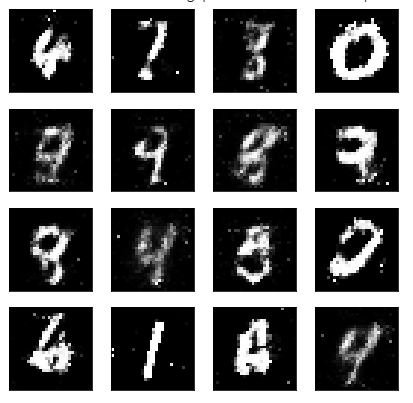

# GANMINST

In this notebook, we'll be building a generative adversarial network (GAN) trained on the MNIST dataset. From this, we'll be able to generate new handwritten digits!

#3 Training loss
Here we'll check out the training losses for the generator and discriminator.

## Generator samples from training
Here we can view samples of images from the generator. First we'll look at images taken while training.
These are samples from the final training epoch. You can see the generator is able to reproduce numbers like 1, 7, 3, 2. Since this is just a sample, it isn't representative of the full range of images this generator can make.

Below I'm showing the generated images as the network was training, every 10 epochs. With bonus optical illusion!

It starts out as all noise. Then it learns to make only the center white and the rest black. You can start to see some number like structures appear out of the noise like 1s and 9s.

## Sampling from the generator

We can also get completely new images from the generator by using the checkpoint we saved after training. We just need to pass in a new latent vector $z$ and we'll get new samples!

